# Laboriatorium 2
---
`temat 13` Tworzenie interfejsu chatbotowego w C#<br>
Zadanie polega na stworzeniu interfejsu chatbota w C# korzystjącego z API OpenAI. Program powinien pozwalać na prowadzenie wieloetapowej rozmowy z użytkownikiem w _konsoli_.


### Podjęte kroki:
#### 1. Utworzenie konta OpenAI i zasilenie go dla uzyskania możliwości odpytania API modelu gpt

<div style="display: flex; gap: 20px;">
  <div style="flex: 1; text-align: center;">

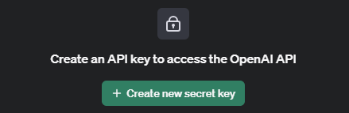
  </div>
  <div style="flex: 1; text-align: center;">
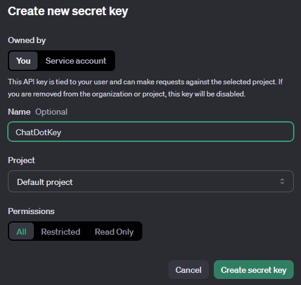
  </div>
</div>

#### 2. Utworzenie zasobu Azure OpenAI
- Zainstalownie rozszerzenia Azure Intelij Community: <br>
```Ctrl+Shift+X``` - otwiera panel z rozszerzeniami
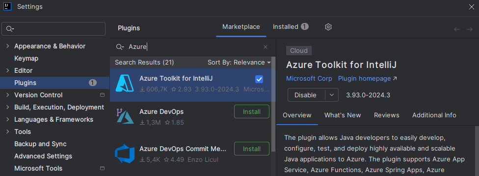
- Wejście w panel Azure Explorer po prawej stronie ekranu
- Zalogowanie się do konta Azure: kliknięcie prawym klawiszem na`Azure`  i wybranie z listy `Sign in`

| Azure Explorer      |
|:------------------:|
| 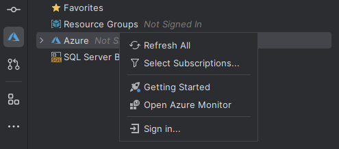   |


- Wybranie trybu logowanie `Azure CLI`

| Opcje logowania      |
|:----------------:|
| 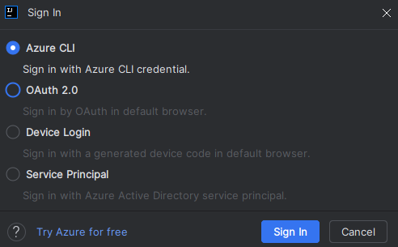     |

- Utworzenie usługi `OpenAI`

<div style="display: flex; gap: 20px;">
  <div style="flex: 1; text-align: center;">
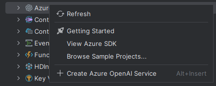
  </div>
  <div style="flex: 1; text-align: center;">
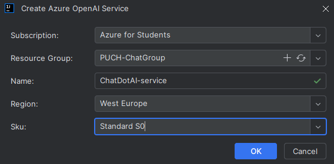
  </div>
</div>

- Utworzenie wdrożenia `deployment` 
<div style="display: flex; gap: 20px;">
  <div style="flex: 1; text-align: center;">
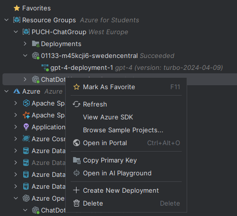
  </div>
  <div style="flex: 1; text-align: center;">
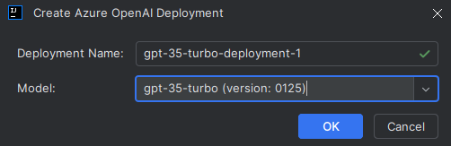
  </div>
</div>


- Odnalezienie grupy zasobów w Portalu Azure
- Wybór `ChatDotAI-service`

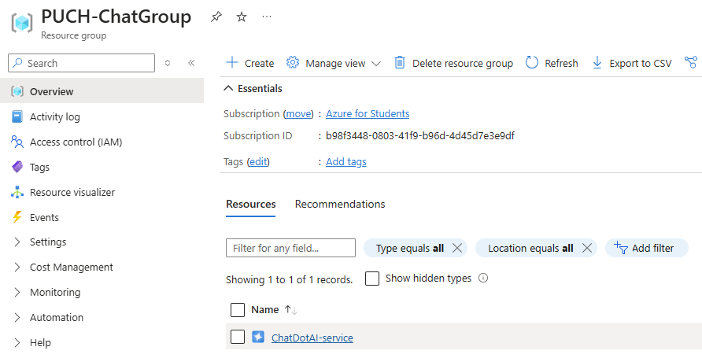
- Wybór `Azure OpenAI Studio`

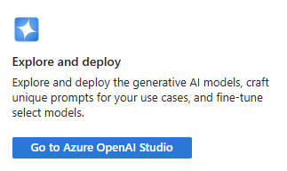

- Przejście do `deployments` (panel po prawej stronie)

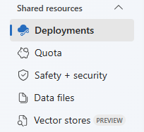

- Wybór typu wdrożenia: [deployment types](https://learn.microsoft.com/en-us/azure/ai-services/openai/how-to/deployment-types#global-standard)
- Podównanie cen dla poszczególnych modeli: [](https://azure.microsoft.com/en-us/pricing/details/cognitive-services/openai-service/)
- Sprawdzenie dostępnych modeli: `quota`
- Wybór `deploy base model`

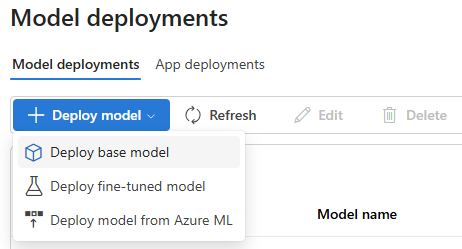

- Wybór modelu `gpt-4`

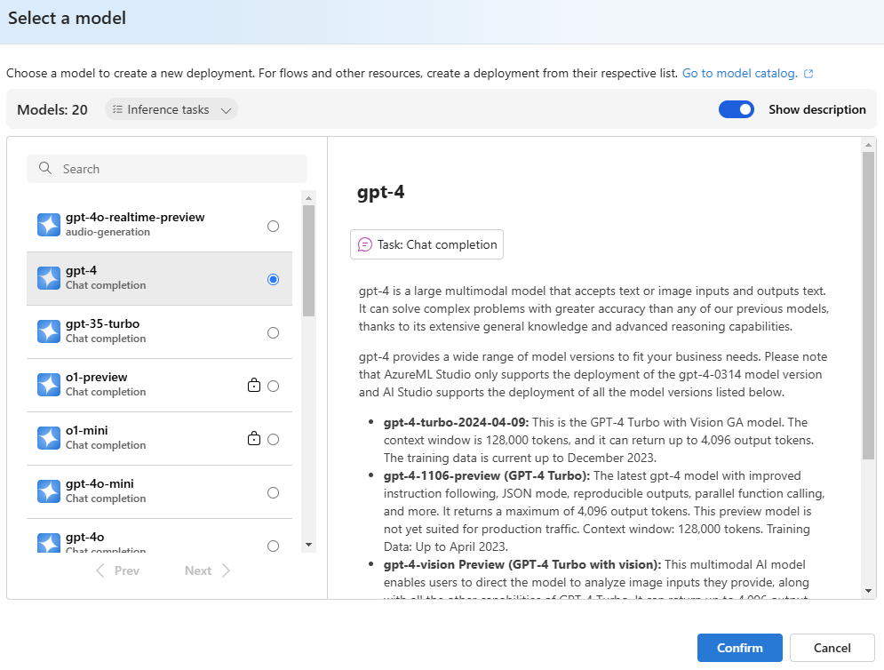

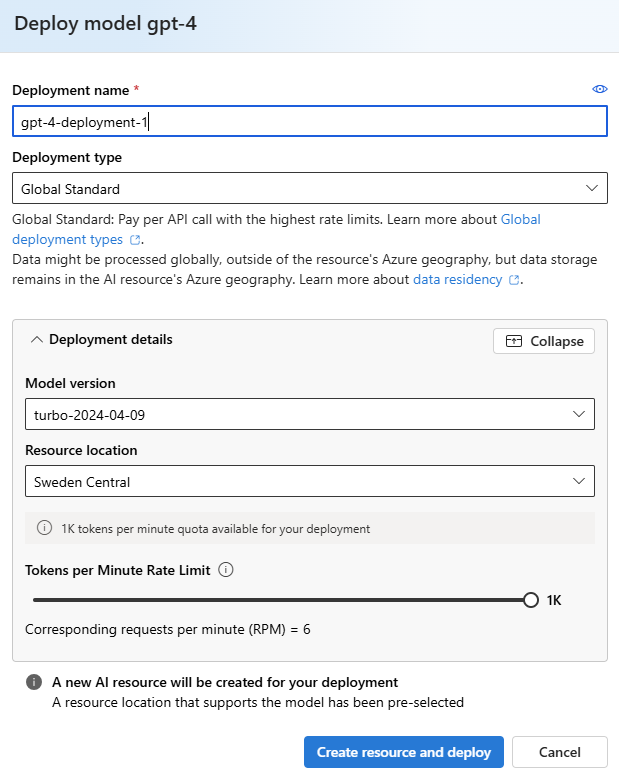

- Wdrożenia widoczne są w Azure Explorer

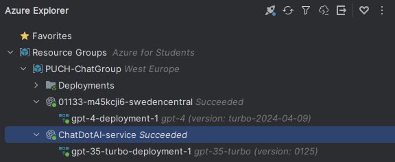


#### 3. Utworzenie aplikacji
- Utworzenie szkieletu aplikacji konsolowej
```bash
dotnet new 
```

- Dodanie zależności 
```bash
dotnet add package Azure.AI.OpenAI
dotnet add package Microsoft.Extensions.Configuration
dotnet add package OpenAI-API-dotnet

```

### Rezultaty: