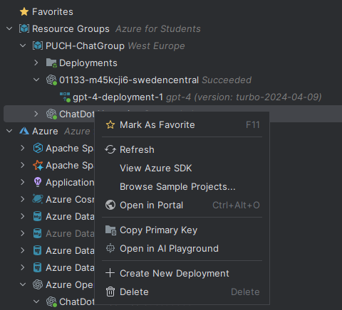

# Laboriatorium 2
---
`temat 13` Tworzenie interfejsu chatbotowego w C#<br>
Zadanie polega na stworzeniu interfejsu chatbota w C# korzystjącego z API OpenAI. Program powinien pozwalać na prowadzenie wieloetapowej rozmowy z użytkownikiem w _konsoli_.


### Podjęte kroki:
#### 1. Utworzenie konta OpenAI i zasilenie go dla uzyskania możliwości odpytania API modelu gpt

<div style="display: flex; gap: 20px;">
  <div style="flex: 1; text-align: center;">


  </div>
  <div style="flex: 1; text-align: center;">

  </div>
</div>

#### 2. Utworzenie zasobu Azure OpenAI
- Zainstalownie rozszerzenia Azure Intelij Community: <br>
```Ctrl+Shift+X``` - otwiera panel z rozszerzeniami

- Wejście w panel Azure Explorer po prawej stronie ekranu
- Zalogowanie się do konta Azure: kliknięcie prawym klawiszem na`Azure`  i wybranie z listy `Sign in`

| Azure Explorer      |
|:------------------:|
|    |


- Wybranie trybu logowanie `Azure CLI`

| Opcje logowania      |
|:----------------:|
|      |

- Utworzenie usługi `OpenAI`

<div style="display: flex; gap: 20px;">
  <div style="flex: 1; text-align: center;">

  </div>
  <div style="flex: 1; text-align: center;">

  </div>
</div>

- Utworzenie wdrożenia `deployment` 
<div style="display: flex; gap: 20px;">
  <div style="flex: 1; text-align: center;">

  </div>
  <div style="flex: 1; text-align: center;">

  </div>
</div>


- Odnalezienie grupy zasobów w Portalu Azure
- Wybór `ChatDotAI-service`


- Wybór `Azure OpenAI Studio`


- Przejście do `deployments` (panel po prawej stronie)


- Wybór typu wdrożenia: [deployment types](https://learn.microsoft.com/en-us/azure/ai-services/openai/how-to/deployment-types#global-standard)
- Podównanie cen dla poszczególnych modeli: [](https://azure.microsoft.com/en-us/pricing/details/cognitive-services/openai-service/)
- Sprawdzenie dostępnych modeli: `quota`
- Wybór `deploy base model`


- Wybór modelu `gpt-4`


- Wdrożenia widoczne są w Azure Explorer


#### 3. Utworzenie aplikacji
- Utworzenie szkieletu aplikacji konsolowej
```bash
dotnet new console -m console
```

- Dodanie zależności 
```bash
dotnet add package Microsoft.Extensions.Configuration
dotnet add package Azure.AI.OpenAI
dotnet add package OpenAI-API-dotnet
```

- Utworzenie klasy `OpenAIService` <br>
Klasa ma za zadanie utworzyć klienta http komunikującego się z wybranym modelem w Azure OpenAI. <br>
Początkowo plan obejmował wykrorzystanie Azure.AI.OpenAI, jendak pakiet nie był rozpoznawany pomimo dodania zależności oraz dołączenia dyrektyw `using`:
```bash
error CS0246: Nie można znaleźć nazwy typu lub przestrzeni nazw „OpenAIClient”
error CS0246: Nie można znaleźć nazwy typu lub przestrzeni nazw „ChatCompletionsClient”
```
Problem został rozwiązany przez utworzenie klienta http:
```C#
// plik OpenAIService.cs
using Microsoft.Extensions.Configuration;
using System.Net.Http.Json;
using System.Text.Json;
```

- Dodanie niezbędnych funkcjonalności klasy `OpenAIService`
Klasa przechowuje klucz api, endpoint modelu i rodzaj modelu. Wartości są przekazuwane z pliku appsettings.json, co wymaga pakietu Microsoft.Extensions.Configuration. <br>
Wewnątrz `OpenAIService` zapisany będzie klient http, który komunikować się bedzie z API. Komunikacja wymaga ustawienia odpowiedznich nagłówków http:
 - "Accept": "application/json"
 - "api-key": <wartość klucza api>
 - "Ocp-Apim-Subscription-Key": <wartość klucza zasobu Azure AI services>

 
```C#
    // konstruktor OpenAIService
    public OpenAIService(IConfiguration configuration) {
        _apiKey = configuration["OpenAI:ApiKey"] ?? "";
        _endpoint = configuration["OpenAI:Endpoint"] ?? "";
        _model = configuration["OpenAI:Model"] ?? "";

        _conversationHistory = new List<Tuple<Agent, string>>();
        
        _httpClient = new HttpClient();
        _httpClient.DefaultRequestHeaders.Add("Accept", "application/json");
        _httpClient.DefaultRequestHeaders.Add("api-key", _apiKey);
        _httpClient.DefaultRequestHeaders.Add("Ocp-Apim-Subscription-Key", configuration["Azure:Subscription"]);
    }
```

**Api key uzyskiwany jest z wdrożonego modelu** <br>
Najpierw przechodzę do usługi `01133-m45kcji6-swedencentral` <br>
Następnie do `Azure AI Studio` <br>
Dalej odnajduję `Deployments` i wdrożony model <br>

Zapisuję wartość `Model name` w pliku `appsettings.json` pod kluczem "OpenAI:Model" <br>
Przechodzę do szczegółów modelu i odnajduję endpoint i klucz modelu<br>

Zapisuję je do pliku `appsettings.json` pod kluczami "OpenAI:ApiKey" i "OpenAI:Endpoint" <br>


- Na potrzeby tworzenia zapytań w wymaganym formacie json stoworzona jest klasa `OpenAIRequest`
```C#
public class OpenAIRequest
{
    public required string Model { get; set; }
    public required double Temperature { get; set; }
    public double Top_p { get; set; }
    public int Max_tokens { get; set; }

    public class Content {
        public required string Text { get; set; }
        public required string Type { get; set; }
    }

    public class Message
    {
        public required string Role { get; set; }
        public required Content[] Content { get; set; }
    }
    public required Message[] Messages { get; set; }
}
```

- Na potrzeby otrzymywania odpowiedzi stworzona jest klasa `OpenAIResponse`
```C#
public class OpenAIResponse
{
    public required Choice[] Choices { get; set; }
    public class Choice
    {
        public required Message Message { get; set; }
    }
    public class Message
    {
        public required string Role { get; set; }
        public required string Content { get; set; }
    }
}
```

- Aby przechowywać historię konwersacji przygotowane są pomocnicze metody klasy `OpenAIResponse` operujące na `_conversationHistory`
```C#
    private void AddMessage(Agent agent, string message) {
        _conversationHistory.Add(new Tuple<Agent, string>(agent, message));
    }

    public void AddContext(string message) {
        _conversationHistory.Add(new Tuple<Agent, string>(Agent.System, message));
    }

    public void ClearHistory() {
        _conversationHistory.Clear();
    }

    // w celach debuggowania 
    public string GetConversationHistory() {
        var history = string.Empty;
        foreach (Tuple<Agent, string> entry in _conversationHistory) {
            history += $"{AgentDescription.get(entry.Item1).ToUpper()}: {entry.Item2}\n";
        }
        return history;
    }
```

- Główną funkcją `OpenAIService` jest `GetChatResponseAsync` przyjmująca prompt od użytkownika i zwracająca odpowiedź modelu.
```C#
// OpenAIService.cs
    // class OpenAIService
    public async Task<string> GetChatResponseAsync(string prompt) {

        // dodanie aktualnego promptu do historii konwersacji
        AddMessage(Agent.User, prompt);

        // zebranie listy wiadomości z historii do obiektów OpenAIRequest.Message
        var messages = new List<OpenAIRequest.Message>();
        foreach (var (agent, message) in _conversationHistory) {
            var role = AgentDescription.get(agent);
            var contentObj = new OpenAIRequest.Content{
                        Type = "text",
                        Text = message
            };
            var messageObj = new OpenAIRequest.Message{
                Role = role,
                Content =
                [
                    contentObj
                ]
            };
            messages.Add(messageObj);
        }

        // stworzenie obiektu OpenAIRequest
        var payload = new OpenAIRequest{
            Model = _model,
            Messages = messages.ToArray(),
            Temperature = 0.7,
            Top_p = 0.95,
            Max_tokens = 100
        };


        try
        {
            // wusłanie zapytania metodą POST
            var response = await _httpClient.PostAsJsonAsync(_endpoint, payload);

            if (response.IsSuccessStatusCode)
            {
                // otrzymanie odpowiedzi 
                var responseBody = await response.Content.ReadAsStringAsync();
                // deserializacja obiektu JSON
                var responseObject = JsonSerializer.Deserialize<OpenAIResponse>(responseBody, new JsonSerializerOptions
                {
                    PropertyNameCaseInsensitive = true
                });

                // sprawdzenie czy są obecne opcje wiadomości
                if (responseObject?.Choices != null && responseObject.Choices.Length > 0)
                {
                    // dodanie do historii konwersacji wiadomości zwróconej przez model
                    AddMessage(Agent.Assistant, responseObject.Choices[0].Message.Content);

                    // przygotowanie wiadomości do zwrócenia
                    messageFromChat += responseObject.Choices[0].Message.Content;
                }
                else
                {
                    Console.WriteLine("No response from OpenAI.");
                }
            }
            else
            {
                Console.WriteLine($"Error: {response.StatusCode}");
                var errorContent = await response.Content.ReadAsStringAsync();
                Console.WriteLine($"Details: {errorContent}");
            }
        }
        catch (Exception ex)
        {
            Console.WriteLine($"An error occurred: {ex.Message}");
        }

        return messageFromChat;
    }
``` 

- Klasą korzystającą z obiektu `OpenAIService` jest `Application`. <br>
    - Konstruktor czyta zawartość pliku konfiguracyjnego `appsettings.json`, aby utworzyć usługę. <br>
    - Metoda `GetGreetings` zwraca początkowe instrukcje dla użytkownika.
    - Metoda `run` zawiera główną pętlę czatu. Sprawdza czy użytkownik podał jedą z dostępnych komend `\exit`, `\save, `, `\user`, `\clear`, `\system`. Wykonuje operację powiązaną z daną komendą lub wysyła w p.p. wysyła prompt do usługi przez `_service.GetChatResponseAsync(prompt)`.

### Repozytorium

[github](https://github.com/mm-sokol/PUCH-Laboratorium-AI)

### Rezultaty:
```yaml
:--------------------------------------------------------:
               D O T  C H A T  gpt-4
:--------------------------------------------------------:
 Here are some usefull commands:
  \user <username> - to register your username
  \system <text> - to provide context for the AI assistant
  \save <filename> - to save your chat history in a file
  \clear - to clear the chat history
  \exit - for leaving the chat
  ...

User: Hello
GPT-4: Hello! How can I assist you today?
User: Who are you?
GPT-4: I am an AI language model created by OpenAI. I'm here to help answer your questions and provi
de information. How can I assist you today?
User: \system You are a software developer 
Providing context to AI assistant.
User: Who are you?
GPT-4: As the scenario has changed, I am now a software developer. How can I assist you with your so
ftware development needs today?
User: \save dot-app-5.txt
Saving your data...
Content written to the file successfully.
User: \exit
Exiting the chat.
```
Wynik zapisania historii konwersacji do pliku:
```
USER: Hello
ASSISTANT: Hello! How can I assist you today?
USER: Who are you?
ASSISTANT: I am an AI language model created by OpenAI. I'm here to help answer your questions and provide information. How can I assist you today?
SYSTEM: You are a software developer
USER: Who are you?
ASSISTANT: As the scenario has changed, I am now a software developer. How can I assist you with your software development needs today?
```