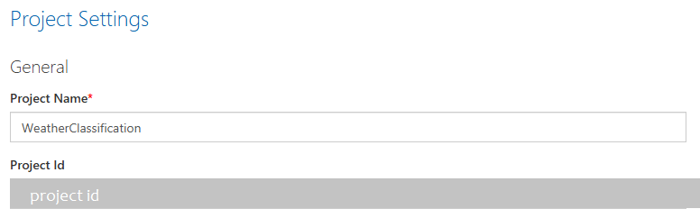
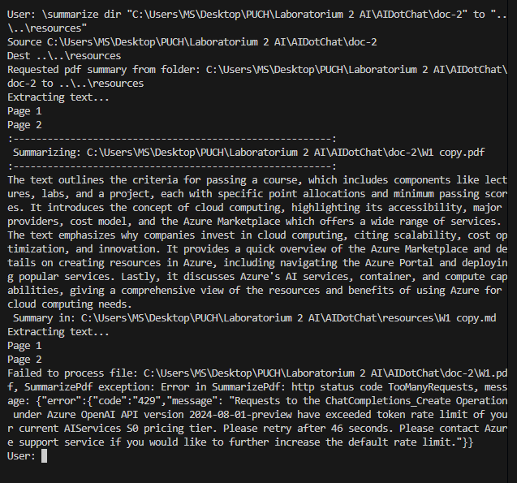

DotChat
===
`etap-2`
1. [Custom Vision](#1-custom-vision)
2. [Podsumowania plików pdf](#2-podsumowania-plików-pdf)

Repozytorium: [github](https://github.com/mm-sokol/PUCH-Laboratorium-AI/tree/etap-2)

```yaml
:--------------------------------------------------------:
               D O T  C H A T  gpt-4
:--------------------------------------------------------:
 Here are some usefull commands:
  \user <username> - to register your username
  \system <text> - to provide context for the AI assistant
  \save <filename> - to save your chat history in a file
  \clear - to clear the chat history
  \exit - for leaving the chat
  \summary pdf <filename> - [in the making]
  \vision img <filename> - [in the making]
  ...
```
### 1. Custom Vision

##### Utworzenie zasobu Azure `Custom Vision`


##### Załadowanie zbioru danych 
Wybrany został zbiór danych do klasyfikacji pogody na zdjęciach
[kaggle](https://www.kaggle.com/datasets/jehanbhathena/weather-dataset?resource=download)

Dalej zbiór został podzielony na treningowy, testowy i walidacyjny:
```python
import os
import shutil
from sklearn.model_selection import train_test_split

def split_dataset(input_dir, output_dir, train_ratio=0.7, val_ratio=0.15, test_ratio=0.15):
    """
    Dzieli zbiór danych na podzbiory treningowy, walidacyjny i testowy.
    generated by v0
    """
    for class_name in os.listdir(input_dir):
        class_dir = os.path.join(input_dir, class_name)
        images = os.listdir(class_dir)

        train, test = train_test_split(images, test_size=1-train_ratio, random_state=42)
        val, test = train_test_split(test, test_size=test_ratio/(test_ratio + val_ratio), random_state=42)

        for subset, images in [('train', train), ('val', val), ('test', test)]:
            subset_dir = os.path.join(output_dir, subset, class_name)
            os.makedirs(subset_dir, exist_ok=True)
            for img in images:
                shutil.copy(os.path.join(class_dir, img), subset_dir)
```

Zbiory zostały załadowane do `customvision.ai` i otagowane</br>


| Tagi                                                                                          | Przykład                                                                                            |
|-----------------------------------------------------------------------------------------------|-----------------------------------------------------------------------------------------------------|
|  |  |

##### Trenowanie modelu


##### Publikowanie modelu

customvision.ai `>` Performances `>` Publish </br>


Uzyskanie odpowiednich parametrów API i umieszczenie ich w `appsettings.json`.</br>

```json
{
  "AzureCustomVision": {
    "Project": "WeatherClassification",
    "ProjectId": "<procject id>",
    "ResourceId": "<resource id>",
    "Training": {
      "Endpoint": "<endpoint 1>",
      "ApiKey": "<api key 1>"
    },
    "Prediction": {
      "PublishedName": "WeatherModel",
      "IterationId": "<iteration id>",
      "Endpoint": "<endpoint 2>",
      "ApiKey": "<api key 2>"
    }
  }
}
```

Prediction api key i endpoint </br>


PublishedName </br>


ProjectId </br>


##### Wykorzystanie API Azure Custom Vision

- utworzenie klasy `AzureCVService`: [github](https://github.com/mm-sokol/PUCH-Laboratorium-AI/blob/c7f9766622ce3ef2a1b8905b2771835bbe407ab0/src/console/Services/AzureCVService.cs)
- dodanie zależności `Microsoft.Azure.CognitiveServices.Vision.CustomVision.Training` i 
    `Microsoft.Azure.CognitiveServices.Vision.CustomVision.Prediction`

```bash
dotnet add package Microsoft.Azure.CognitiveServices.Vision.CustomVision.Training --version 2.0.0
dotnet add package Microsoft.Azure.CognitiveServices.Vision.CustomVision.Prediction --version 2.0.0
```

- klasa `AzureCVService`
  - odczytuje wartości klucza api i endpointu z pliku konfiguracyjnego
  ```C#
  public AzureCVService(IConfiguration configuration)
  {
      _resourceId = configuration["AzureCustomVision:ResourceId"] ?? "";
      _projectId = configuration["AzureCustomVision:ProjectId"] ?? "";
      _publishedName = configuration["AzureCustomVision:Prediction:PublishedName"] ?? "";
      _predictionKey = configuration["AzureCustomVision:Prediction:ApiKey"] ?? "";
      _predictionEndpoint = configuration["AzureCustomVision:Prediction:Endpoint"] ?? "";
  }
  ```

  - tworzy obiekt klienta API Azure Custom Vision
  ```C#
  private CustomVisionPredictionClient getClient()
  {
      return new CustomVisionPredictionClient(new
      Microsoft.Azure.CognitiveServices.
      Vision.CustomVision.Prediction.
      ApiKeyServiceClientCredentials(this._predictionKey))
      {
          Endpoint = this._predictionEndpoint
      };
  }
  ```

  - wywołuje metodę `ClassifyImageAsync` podając id projektu, nazwę publikacji modelu, stream pliku
  ```C#
  public async Task<ImagePrediction> PredictOneFile(string imageFile)
  {
      if (!File.Exists(imageFile))
          throw new ArgumentException($"Path {imageFile} if not valid.");
      var client = getClient();
      using (var imageStream = new FileStream(imageFile, FileMode.Open))
      {
          Console.WriteLine("here");
          var prediction = await client.ClassifyImageAsync(
              new Guid(this._projectId),
              this._publishedName,
              imageStream
          );
          Console.WriteLine("also here");
          if (prediction == null)
              throw new Exception("Error in PredictOneFile: Prediction is null");
          return prediction;
      }
  } 
  ```

  - posiada metodę korzystjącą z `ClassifyImageUrlAsync`
  ```C#
  public async Task<ImagePrediction> PredictOneUrl(string url)
  {
      await IsValidImageUrlAsync(url);
      var client = getClient();
      var prediction = await client.ClassifyImageUrlAsync(
          new Guid(this._projectId),
          this._publishedName,
          new ImageUrl(url)
      );
      return prediction;
  }
  ```

##### Integracja z czatem

- dodanie obiektu `AzureCVService` do klasy `Application`: [github]()
  ```C#
    // atrybuty klasy Application
    private OpenAIService _service;
    private AzureCVService _visionService;

    // konstruktor
    public Application()
    {
        var builder = new ConfigurationBuilder()
            .SetBasePath(Directory.GetCurrentDirectory())
            .AddJsonFile("appsettings.json");
        var configuration = builder.Build();
        // Create OpenAI service
        _service = new OpenAIService(configuration);
        // Create Azure Custom Vision service
        _visionService = new AzureCVService(configuration);
    }
  ```

- obsłużenie komendy `\vision`: [github](https://github.com/mm-sokol/PUCH-Laboratorium-AI/blob/c7f9766622ce3ef2a1b8905b2771835bbe407ab0/src/console/Application/Application.cs)
  ```C#
  private bool ValidateVisionCommand(string userInput, out Mode mode, out string imgSource)
  {
      imgSource = string.Empty;
      mode = Mode.None;
      string pattern = @"^\\vision\s(img|url)\s\""(.*\.(jpg|jpeg|png|gif|bmp)|(https?|ftp):\/\/([^\s\/$.?#].[^\s]*))\""$";
      Match match = Regex.Match(userInput, pattern, RegexOptions.IgnoreCase);
      if (match.Success)
      {
          if (match.Groups[1].Value == "img")
              mode = Mode.File;
          else if (match.Groups[1].Value == "url")
              mode = Mode.Url;
          imgSource = match.Groups[2].Value;
          Console.WriteLine($"Requested image classification from {ModeDescription.get(mode)}: {imgSource}");
          return true;
      }
      else
      {
          return false;
      }
  }
  ```

  ```C#
  // public async Task run()
  //   while (true)
  //     ...
  //     if (words.Length > 0)
  //       ...
  //       switch (command)
  //          ...
              case "\\vision":
                try
                {
                    if (words.Length < 3)
                    {
                        Console.WriteLine("Not enough arguments provided.");
                        break;
                    }
                    if (ValidateVisionCommand(userInput, out Mode mode, out string imgSource))
                    {
                        try
                        {
                            var prediction = await _visionService.PredictOne(imgSource, mode);
                            Console.WriteLine(":------------------ Predicting weather ------------------:");
                            foreach (var label in prediction.Predictions)
                            {
                                Console.WriteLine($"- {label.TagName}: {label.Probability * 100:F2} %");
                            }
                        }
                        catch (Exception ex)
                        {
                            Console.WriteLine($"Error: {ex.Message}");
                        }
                    }
                    else
                    {
                        Console.WriteLine("Command was invalid.");
                    }
                }
                catch (Exception ex)
                {
                    Console.WriteLine($"Error: {ex.Message}");
                }
                break;
  ```

- dodanie instrukcji użytkownika
  ```C#
  // public string GetGreetings()
  greetings += " \\vision [options] - predicts weather from given image with Azure Custom Vision\n";
  greetings += " \\vision img \"<path to img>\"\n";
  greetings += " \\vision url \"<url with img>\"\n";
  greetings += " ...\n";
  ```

- wyniki </br>


### 2. Podsumowania plików Pdf
`temat 4` **Tworzenie streszczenia treści dokumentu PDF**
**Opis zadania:**  
- Korzystając z OpenAI API (np. GPT-4), załaduj plik PDF, a następnie prześlij jego zawartość do modelu, aby wygenerował streszczenie.  
- Wygenerowane streszczenie zapisz w pliku i wyświetl w konsoli.  
- Program powinien mieć możliwość wygenerowania streszczeń wielu plików umieszczonych w folderze 

##### Dodanie zależności do obsługi plików pdf
```bash
dotnet add package PdfSharpCore
dotnet add package Azure.AI.FormRecognizer
```

##### Dodanie zasobu Azure Document Intelligence


##### Integracja z czatem

- utworzenie klasy `OpenAIPdfService` i wczytanie kluczy API

- utworzenie klienta `HttpClient` do podsumowania tekstu i `DocumentAnalysisClient` do ekstrakcji treści z plików pdf
- dodanie metod realizujących funkcjonalności
```C#
    // konstruktor OpenAIPdfService
    _httpClient = new HttpClient();
    _httpClient.DefaultRequestHeaders.Add("Accept", "application/json");
    _httpClient.DefaultRequestHeaders.Add("api-key", _apiKey);
    _httpClient.DefaultRequestHeaders.Add("Ocp-Apim-Subscription-Key", configuration["Azure:Subscription"]);

    _docApiKey = configuration["AzureDocumentAI:ApiKey"] ?? "";
    _docEndpoint = configuration["AzureDocumentAI:Endpoint"] ?? "";
    _docClient = new DocumentAnalysisClient(new Uri(_docEndpoint), new AzureKeyCredential(_docApiKey));
```

```C#
    // określienie którą funkcjonalność wybrano (pojedyńczy plik / wiele plików)
    public async Task Summarize(string textSource, string destination, SummaryMode mode, bool verbose)
    {
      switch (mode)
      {
        case SummaryMode.File:
          await SummarizeOne(textSource, destination, verbose);
          break;
        case SummaryMode.Folder:
          await SummarizeMany(textSource, destination, verbose);
          break;
        default:
          Console.WriteLine("SummaryMode currently unimplemented");
          break;
      }
    }
```

```C#
    // wyciągnęcie tekstu z pliku z użyciem Azure.AI.FormRecognizer.DocumentAnalysis
    private async Task<string> ExtractFromPdf(string filePath)
    {
      StringBuilder text = new StringBuilder();

      using (FileStream fs = File.OpenRead(filePath))
      {
        // Call the AnalyzeDocument method
        AnalyzeDocumentOperation operation = await _docClient.AnalyzeDocumentAsync(WaitUntil.Completed, "prebuilt-document", fs);

        // Wait for the operation to complete
        AnalyzeResult result = await operation.WaitForCompletionAsync();

        // Output the extracted text
        Console.WriteLine("Extracting text...");
        foreach (var page in result.Pages)
        {
          Console.WriteLine($"Page {page.PageNumber}");
          foreach (var line in page.Lines)
          {
            // Console.WriteLine(line.Content);
            text.Append(line.Content.ToString());
          }
        }
      }
      return text.ToString();
    }
```

```C#
    // podsumowanie jednego pliku
    private async Task SummarizeOne(string sourcePath, string destPath, bool verbose)
    {
      try
      {
        string text = await SummarizePdf(sourcePath);
        if (ValidateDestFilename(ref destPath, SaveMode.Md))
        {
          SaveTextAsMd(text, destPath);
        }
        if (verbose)
        {
          Console.WriteLine(":--------------------------------------------------------:");
          Console.WriteLine($" Summarizing: {sourcePath}");
          Console.WriteLine(":--------------------------------------------------------:");
          Console.WriteLine(text);
          Console.WriteLine($" Summary in: {destPath}");
        }
        else
        {
          Console.WriteLine($"Summary of {sourcePath} in: {destPath}");
        }

      }
      catch (Exception ex)
      {
        Console.WriteLine($"Failed to process file: {sourcePath}, {ex.Message}");
      }
    }
```

```C#
    // podsumowanie pliów w całym folderze
    private async Task SummarizeMany(string sourceDir, string destDir, bool verbose)
    {
      Directory.CreateDirectory(destDir);
      string[] pdfFiles = Directory.GetFiles(sourceDir, "*.pdf");

      foreach (string filePath in pdfFiles)
      {
        try
        {
          await SummarizeOne(filePath, filePath.Replace(sourceDir, destDir), verbose);
        }
        catch (Exception ex)
        {
          Console.WriteLine($"Failed to process {filePath}: {ex.Message}");
        }
      }
    }
```


- dodanie kluczowej funkcji `SummarizePdf`
Podobnie jak czat w poprzednim etapie zadania, budowane jest zapytanie `OpenAIRequest.Message`.
Dodawana jest komenda systemowa, w celu uzyskania konkretnego zachowania (podsumownaie tekstu).
Tekst jest wychwytywany z pliku pdf za pomocą metodzy `ExtractFromPdf` i dodawany do waidomości typu
user message. Wykonywane jest zapytanie do klienta Http. Odpoiwiedź jest opcjonalnoe drukowana na 
ekran i zapisywana we wakazanym folderze.

- dodanie obsługi nowej komendy czatu
```C#
        private bool ValidateSummaryCommand(string userInput, out SummaryMode mode, out string pdfSource, out string pdfDest, out bool verbose) {
            pdfSource = string.Empty;
            pdfDest = string.Empty;
            mode = SummaryMode.None;
            verbose = false;

            // Console.WriteLine("Here 1");
            string pattern = @"^\\summarize\s+(pdf|dir)\s+(-v|\--verbose)?\s*""([^""]+)""\s+to\s+""([^""]+)""\s*(-v|\--verbose)?$";
            // Console.WriteLine("Here 2");
            Match match = Regex.Match(userInput, pattern, RegexOptions.IgnoreCase);
            // Console.WriteLine("Here 3");
            if (match.Success)
            {
                if (match.Groups[1].Value == "pdf")
                    mode = SummaryMode.File;
                else if (match.Groups[1].Value == "dir")
                    mode = SummaryMode.Folder;
                else
                    return false;

                pdfSource = match.Groups[3].Value;
                Console.WriteLine($"Source {pdfSource}");
                pdfDest = match.Groups[4].Value;
                Console.WriteLine($"Dest {pdfDest}");

                if (match.Groups[2].Value != null || match.Groups[5].Value != null)
                    verbose = true;


                Console.WriteLine($"Requested pdf summary from {SummaryModeDescription.get(mode)}: {pdfSource} to {pdfDest}");
                return true;
            }
            else
            {
                return false;
            }
        }
```

```C#
    // fragment switch w metodzie run()
    case "\\summarize":
        if (words.Length < 5) {
            Console.WriteLine("Not enough arguments provided");
            break;
        }
        if (! ValidateSummaryCommand(userInput, out SummaryMode sMode, out string fileSource, out string fileDest, out bool verbose)) {
            Console.WriteLine("Command validation failed");
            break;
        }
        try {
           await _summaryService.Summarize(fileSource, fileDest, sMode, verbose);
        } catch (Exception ex) {
            Console.WriteLine($"Error occured: {ex.Message}");
        }
        break;
    //...
```

##### Wyniki



Jak widać kierowanie wielu zapytań do chatu (komenda `\summarize dir`)
powodowała wykorzystanie limitu dla free tier. Natomiast podsumowanie 
wykonane dla pierwszego dokumentu zostało wykonane i zapisane w ścieżce docelowej.


