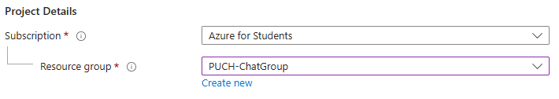
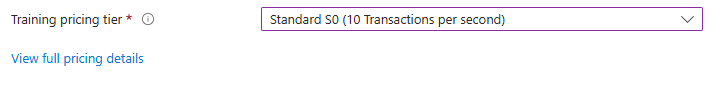
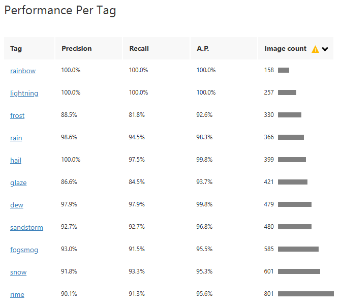
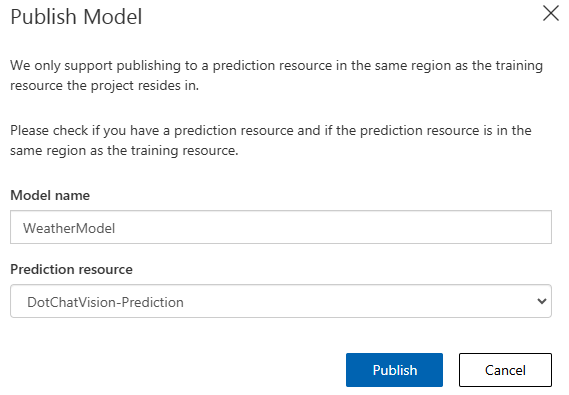
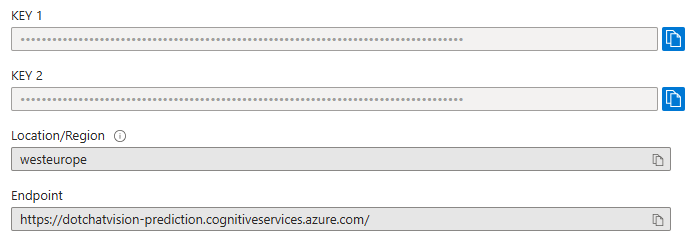

DotChat
===
`etap-2`
1. [Custom Vision](#1-custom-vision)
2. [Podsumowania plików pdf](#2-podsumowania-plików-pdf)

```yaml
:--------------------------------------------------------:
               D O T  C H A T  gpt-4
:--------------------------------------------------------:
 Here are some usefull commands:
  \user <username> - to register your username
  \system <text> - to provide context for the AI assistant
  \save <filename> - to save your chat history in a file
  \clear - to clear the chat history
  \exit - for leaving the chat
  \summary pdf <filename> - [in the making]
  \vision img <filename> - [in the making]
  ...
```
### 1. Custom Vision

##### Utworzenie zasobu Azure `Custom Vision`






##### Załadowanie zbioru danych 
Wybrany został zbiór danych do klasyfikacji pogody na zdjęciach
[kaggle](https://www.kaggle.com/datasets/jehanbhathena/weather-dataset?resource=download)

Dalej zbiór został podzielony na treningowy, testowy i walidacyjny:
```python
import os
import shutil
from sklearn.model_selection import train_test_split

def split_dataset(input_dir, output_dir, train_ratio=0.7, val_ratio=0.15, test_ratio=0.15):
    """
    Dzieli zbiór danych na podzbiory treningowy, walidacyjny i testowy.
    generated by v0
    """
    for class_name in os.listdir(input_dir):
        class_dir = os.path.join(input_dir, class_name)
        images = os.listdir(class_dir)

        train, test = train_test_split(images, test_size=1-train_ratio, random_state=42)
        val, test = train_test_split(test, test_size=test_ratio/(test_ratio + val_ratio), random_state=42)

        for subset, images in [('train', train), ('val', val), ('test', test)]:
            subset_dir = os.path.join(output_dir, subset, class_name)
            os.makedirs(subset_dir, exist_ok=True)
            for img in images:
                shutil.copy(os.path.join(class_dir, img), subset_dir)
```

Zbiory zostały załadowane do `customvision.ai` i otagowane</br>


| Tagi                                                                                          | Przykład                                                                                            |
|-----------------------------------------------------------------------------------------------|-----------------------------------------------------------------------------------------------------|
|  |  |

##### Trenowanie modelu




##### Publikowanie modelu

customvision.ai `>` Performances `>` Publish </br>



Uzyskanie odpowiednich parametrów API i umieszczenie ich w `appsettings.json`.</br>

```json
{
  "AzureCustomVision": {
    "Project": "WeatherClassification",
    "ProjectId": "<procject id>",
    "ResourceId": "<resource id>",
    "Training": {
      "Endpoint": "<endpoint 1>",
      "ApiKey": "<api key 1>"
    },
    "Prediction": {
      "PublishedName": "WeatherModel",
      "IterationId": "<iteration id>",
      "Endpoint": "<endpoint 2>",
      "ApiKey": "<api key 2>"
    }
  }
}
```

Prediction api key i endpoint </br>




PublishedName </br>


ProjectId </br>


##### Wykorzystanie API Azure Custom Vision

- utworzenie klasy `AzureCVService`: [github](https://github.com/mm-sokol/PUCH-Laboratorium-AI/blob/ec550b033ee8680bfd6cf7f4d4f201bca8e850e6/src/console/Services/AzureCVService.cs)
- dodanie zależności `Microsoft.Azure.CognitiveServices.Vision.CustomVision.Training` i 
    `Microsoft.Azure.CognitiveServices.Vision.CustomVision.Prediction`

```bash
dotnet add package Microsoft.Azure.CognitiveServices.Vision.CustomVision.Training --version 2.0.0
dotnet add package Microsoft.Azure.CognitiveServices.Vision.CustomVision.Prediction --version 2.0.0
```

- klasa `AzureCVService`
  - odczytuje wartości klucza api i endpointu z pliku konfiguracyjnego
  ```C#
  public AzureCVService(IConfiguration configuration)
  {
      _resourceId = configuration["AzureCustomVision:ResourceId"] ?? "";
      _projectId = configuration["AzureCustomVision:ProjectId"] ?? "";
      _publishedName = configuration["AzureCustomVision:Prediction:PublishedName"] ?? "";
      _predictionKey = configuration["AzureCustomVision:Prediction:ApiKey"] ?? "";
      _predictionEndpoint = configuration["AzureCustomVision:Prediction:Endpoint"] ?? "";
  }
  ```

  - tworzy obiekt klienta API Azure Custom Vision
  ```C#
  private CustomVisionPredictionClient getClient()
  {
      return new CustomVisionPredictionClient(new
      Microsoft.Azure.CognitiveServices.
      Vision.CustomVision.Prediction.
      ApiKeyServiceClientCredentials(this._predictionKey))
      {
          Endpoint = this._predictionEndpoint
      };
  }
  ```

  - wywołuje metodę `ClassifyImageAsync` podając id projektu, nazwę publikacji modelu, stream pliku
  ```C#
  public async Task<ImagePrediction> PredictOneFile(string imageFile)
  {
      if (!File.Exists(imageFile))
          throw new ArgumentException($"Path {imageFile} if not valid.");
      var client = getClient();
      using (var imageStream = new FileStream(imageFile, FileMode.Open))
      {
          Console.WriteLine("here");
          var prediction = await client.ClassifyImageAsync(
              new Guid(this._projectId),
              this._publishedName,
              imageStream
          );
          Console.WriteLine("also here");
          if (prediction == null)
              throw new Exception("Error in PredictOneFile: Prediction is null");
          return prediction;
      }
  } 
  ```

  - posiada metodę korzystjącą z `ClassifyImageUrlAsync`
  ```C#
  public async Task<ImagePrediction> PredictOneUrl(string url)
  {
      await IsValidImageUrlAsync(url);
      var client = getClient();
      var prediction = await client.ClassifyImageUrlAsync(
          new Guid(this._projectId),
          this._publishedName,
          new ImageUrl(url)
      );
      return prediction;
  }
  ```

##### Integracja z czatem

- dodanie obiektu `AzureCVService` do klasy `Application`: [github]()
```C#
  // atrybuty klasy Application
  private OpenAIService _service;
  private AzureCVService _visionService;

  // konstruktor
  public Application()
  {
      var builder = new ConfigurationBuilder()
          .SetBasePath(Directory.GetCurrentDirectory())
          .AddJsonFile("appsettings.json");
      var configuration = builder.Build();
      // Create OpenAI service
      _service = new OpenAIService(configuration);
      // Create Azure Custom Vision service
      _visionService = new AzureCVService(configuration);
  }
```

- obsłużenie komendy `\vision`
```C#
```

- dodanie instrukcji użytkownika
```C#
```

- wyniki


### 2. Podsumowania plików Pdf


