DotChat
===
`etap-3`
1. [Custom Document](#1-custom-document)
  - [Storage Account](#4-tworzenie-storage-account)
  - [Blob Storage Container](#5-dodanie-kontenera-do-storage-account)
  - [Projekt w Document Intelligence Studio](#7-utworzenie-projektu-w-document-intelligence-studio)
  - [Trenowanie modelu](#8-trenowanie-modelu)
  - [Integracja z czatem](#9-integracja-z-chatem)
  - [Testy](#10-testy)

2. [temat 7: Generowanie obrazów na podstawie opisu](#2-generowanie-obrazów-na-podstawie-opisu)

Repozytorium: [github](https://github.com/mm-sokol/PUCH-Laboratorium-AI/tree/etap-3)

Crediting data sources:
- [ExpressExpense.com](https://expressexpense.com/blog/free-receipt-images-ocr-machine-learning-dataset/)
- [OCR Receipts from Grocery Stores Text Detection - kaggle dataset](https://www.kaggle.com/datasets/trainingdatapro/ocr-receipts-text-detection)

```yaml
:--------------------------------------------------------:
               D O T  C H A T  gpt-4
:--------------------------------------------------------:
 Here are some usefull commands:
  \user <username> - to register your username
  \system <text> - to provide context for the AI assistant
  \save <filename> - to save your chat history in a file
  \clear - to clear the chat history
  \exit - for leaving the chat

  \vision [options] - predicts weather from 
  given image with Azure Custom Vision
  \vision img "<path to img>"
  \vision url "<url with img>"

  \summarize [options] - creates summaries of pdf files with OpenAI
  \summarize pdf "<in filename>" to "<out filename>"
  \summarize dir "<source path>" to "<dest path>"
  \summarize ... -v|--verbose - outputs summary to screen

  \doc <filename> - [in the making]
  \img <description> - [in the making]
  ...
```

### 1. Custom Document

1. Ze względu na to, że w poprzednim etapie został już utworzony zasób Document Intelligence ten krok został tu pominięty
2. Przejście do `Document Intelligence Studio`


3. Wybranie `Custom extractoin model` na dole strony


Ponieważ projekt wymaga użycia `Blob Storage Container` został utworzony `Storatge Account`

#### 4. Tworzenie `Storage Account`


#### 5. Dodanie kontenera do `Storage Account`


6. Dodanie danych traningowych do kontenera


#### 7. Utworzenie projektu w `Document Intelligence Studio`


*krok 1 w konfiguracji projektu*


*krok 2 w konfiguracji projektu*


*krok 3 konfiguracji*


#### 8. Trenowanie modelu

- etykietowanie danych automatyczne


*nie było możliwe zaetykietowanie wszystkich obrazów*


*obrazy były etykietowane pojedyńczo*

*okazjonalnie występowały konfilkty etykiet*


*rozwiązywane przez usuwanie jednej z nakładających się etykiet*


<table>
  <tr>
    <th colspan="2">Wyniki etykietowania</th>
    <th colspan="1">Przykładowe Etykiety</th>
  </tr>
  <tr>
    <td>
      <div style="text-align: center;">
        
      </div>
    </td>
    <td>
      <div style="text-align: center;">
        
      </div>
    </td>
    <td>
      <div style="text-align: center;">
        
      </div>
    </td>
  </tr>
</table>

*trenowanie modelu*
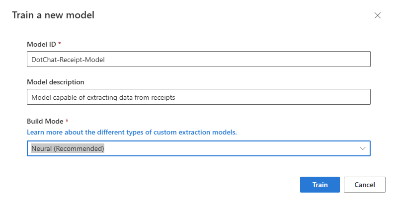

#### 9. Integracja z chatem
- dodanie zależności

```bash
dotnet add package Azure.AI.FormRecognizer
```

- zapisanie kluczy </br>
Ze względu wykorzystania zasobu `Document Intelligence` w poprzedniej części projektu, dodany został tylko model Id do pliku `appsettings.json` </br>
```json
  "AzureDocumentAI":{
    "Endpoint": "<endpoint>",
    "ApiKey": "<key>",
    "Model": "DotChat-Receipt-Model"
  }
```

- stworzenie klasy serwisu: `AzureCDIReceiptService` </br>
Klasa będzie realizowała komunikację z API przez klienta `DocumentAnalysisClient`. Do wyboru będą dwie możliwości zapisu `xlsx` oraz `json`. </br>
**Kluczowymi metodami klasy są:**
  - konstruktor - odczytuje wartości klucza, endpointu, modelu z pliku konfiguracji
```C#
    public AzureCDIReceiptService(IConfiguration configuration)
    {
      _apiKey = configuration["AzureDocumentAI:ApiKey"] ?? "";
      _endpoint = configuration["AzureDocumentAI:Endpoint"] ?? "";
      _modelId = configuration["AzureDocumentAI:Model"] ?? "";

      var credential = new AzureKeyCredential(_apiKey);
      var uri = new Uri(_endpoint);

      _client = new DocumentAnalysisClient(uri, credential);
    }
```

  - ExtractOne - zlecająca analizę jednego pliku (obrazka jpg), realizująca wyświetlenie treści i zapis
```C#
    public async Task ExtractOne(
      string sourcePath, 
      string destPath, 
      SaveMode mode, bool verbose
      )
    {
      try
      {
        AnalyzeResult result = await ExtractReceipt(sourcePath);

        if (verbose)
        {
          foreach (AnalyzedDocument document in result.Documents)
          {
            Console.WriteLine($"Document of type: {document.DocumentType}");
            foreach (KeyValuePair<string, DocumentField> field in document.Fields)
            {
              string fieldName = field.Key;
              DocumentField fieldValue = field.Value;
              Console.WriteLine($"field: {fieldName}");
              Console.WriteLine($"  - value: {fieldValue.Content}");
              Console.WriteLine($"  - confidence: {fieldValue.Confidence} %");

            }
          }
        }
        else
        {
          Console.WriteLine($"Extracted receipt form {sourcePath} to {destPath}");
        }

        if (mode == SaveMode.Json && ValidateDestFilename(ref destPath, mode))
        {
          SaveReceiptAsJson(result, destPath);
        }
      }
      catch (Exception ex)
      {
        Console.WriteLine($"Failed to process receipt: {sourcePath}, {ex.Message}");
      }
    }
```

  - ExtractReceipt - realizująca samą komunikację z API
```C#
    private async Task<AnalyzeResult> ExtractReceipt(string imageFile)
    {
      if (!File.Exists(imageFile))
        throw new ArgumentException($"Path {imageFile} if not valid.");

      using (var imageStream = new FileStream(imageFile, FileMode.Open))
      {
        var operation = await _client.AnalyzeDocumentAsync(
            WaitUntil.Completed,
            _modelId,
            imageStream
        );
        if (operation == null)
          throw new Exception("Error in ExtractReceipt: Analyze operation is null");
        return operation.Value;
      }
    }
```

  - SaveReceiptAsJson - realizująca zapis do pliku `json`
```C#
    private void SaveReceiptAsJson(AnalyzeResult result, string filename)
    {
      string json = JsonConvert.SerializeObject(result, Formatting.Indented);
      try
      {
        File.WriteAllText(filename, json);
      }
      catch (Exception ex)
      {
        Console.WriteLine($"An error occurred while writing json file: {ex.Message}");
      }
      Console.WriteLine($"Saved json file: {filename}");
    }
```

- dodanie specjalnej komendy i obiektu `AzureCDIReceiptService` do aplikacji </br>
Komenda musi być obsłużona w metodzie `run` klasy `Application`
```C#
  // ... run()
  // ... while(true)
  // ... switch(command)
  case "\\receipt":
      if (words.Length < 6) {
          Console.WriteLine("Not enough arguments provided.");
          break;
      }
      // extracion mode currently unused
      if (!ValidateReceiptCommand(userInput, 
      out ExtractionMode eMode, out string sourcePath,
      out AzureDocumentAI.SaveMode receiptSaveMode, out string destPath,
      out bool reseiptVerbose
      )) {
          Console.WriteLine("Failed \receipt command validation.");
          break;
      }
      try {
          await _receiptService.ExtractOne(
              sourcePath, destPath, receiptSaveMode, reseiptVerbose
          );
      } catch (Exception ex) {
          Console.WriteLine(
            $"Error occured while processing \\receipt command: {ex.Message}"
            );
      }
      break;
  // the default case ...
```
Treść komendy musi być zwalidowana w metodzie `ValidateReceiptCommand` klasy `Application`
```C#
private bool ValidateReceiptCommand(string userInput,
    out ExtractionMode eMode, out string sourcePath,
    out AzureDocumentAI.SaveMode sMode, out string destPath,
    out bool verbose)
{

  sourcePath = string.Empty;
  destPath = string.Empty;
  eMode = ExtractionMode.None;
  sMode = AzureDocumentAI.SaveMode.None;
  verbose = false;

  string pattern = @"\\receipt\s+(-v|--verbose)?\s?(jpg)\s+""([^""]+)""\s+to\s+(json)\s+""([^""]+)""\s*(-v|--verbose)?\s?";
  Match match = Regex.Match(userInput, pattern, RegexOptions.IgnoreCase);
  if (!match.Success)
  {
      return false;
  }

  // Groups
  // 1, 6) -v, --verbose
  // 2) jpg
  // 3) sourcePath
  // 4) json (only option for now)
  // 5) destPath

    if (!string.IsNullOrEmpty(match.Groups[1].Value) || !string.IsNullOrEmpty(match.Groups[6].Value))
    {
        verbose = true;
    }
    if (match.Groups[2].Value == "jpg")
    {
        eMode = ExtractionMode.Jpg;
    }
    if (match.Groups[4].Value == "json")
    {
        sMode = AzureDocumentAI.SaveMode.Json;
    }
    sourcePath = match.Groups[3].Value;
    destPath = match.Groups[5].Value;

    return true;
}
```

- dodanie instrukcji użytkownika

#### 10. Testy
- brak komendy `verbose`, brak wyświetlenia wyniku, ale zapisano plik
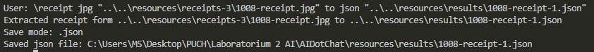

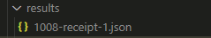

```json
{
  "ServiceVersion": "2023-07-31",
  "ModelId": "DotChat-Receipt-Model",
  "Content": "Dona Mercedes Restaurant 1030 1/2 San Fernando Rd San Fernando CA 91341\nVero CENTER L\n1 CHicharon\n$2.25\n3 Pupusa Queso\n$6.75\n1 Platanos Orden\n$7.75\n1 Diet coke\n$1.50\n2 Quesadilla salvadorena\n$4.00\nSUBTOTAL: $22.25\nTAX: $2.22\nTOTAL: $24.47\nTIP SUGGESTIONS 18%: $4.40 20%: $4.89 25%: $6.12\nThank You!",
  "Pages": [
    {
      "Unit": 0,
      "PageNumber": 1,
      "Angle": 0.8636075,
      "Width": 750.0,
      "Height": 1000.0,
      "Spans": [
        {
          "Index": 0,
          "Length": 298
        }
      ],
      "Words": [
        {
          "BoundingPolygon": [
            {
              "IsEmpty": false,
              "X": 190.0,
              "Y": 71.0
            },
            {
              "IsEmpty": false,
              "X": 251.0,
              "Y": 71.0
            },
            {
              "IsEmpty": false,
              "X": 251.0,
              "Y": 87.0
            },
  // ...
```

- komenda `verbose`, wyświetlono wyniki
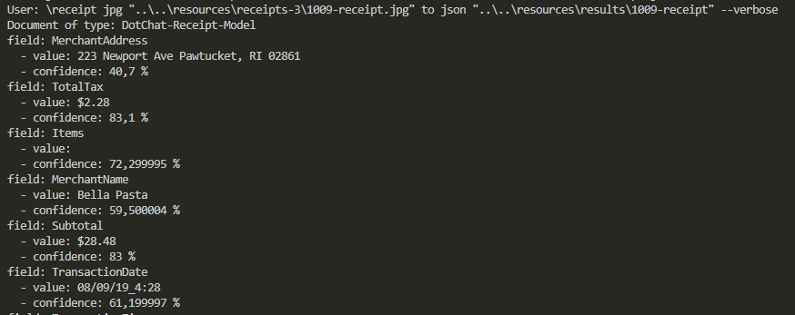

- komenda źle sformatowana, uzyskano informację o błędzie
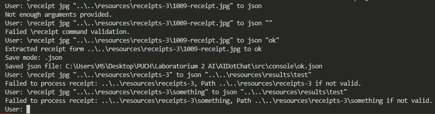


### 2. Generowanie obrazów na podstawie opisu

#### 1. Uworzenie wdrożenia modelu dall-e
W poprzednim etapie utworzony został zasób `Azure OpenAI` nazwany `ChatDotAI-service`. Po odszukaniu go w grupie zasobów dostaję się do `Azure AI Foundry Portal`. Wybieram `Images` w lewym panelu. Nie jest możliwe utworzenie modelu `dall-e` w regionie West Europe.

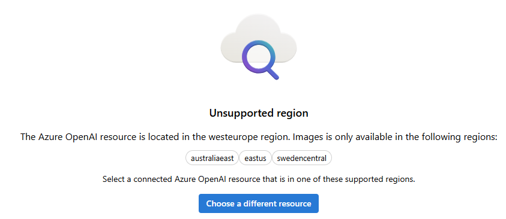

Przechodzę do utworzonego wcześniej zasobu typu `Azure AI services` utworzonego w regionie Sweden Central. Dalej do portalu `Azure AI Foundry Portal`>`Images`.

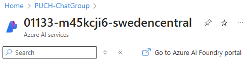

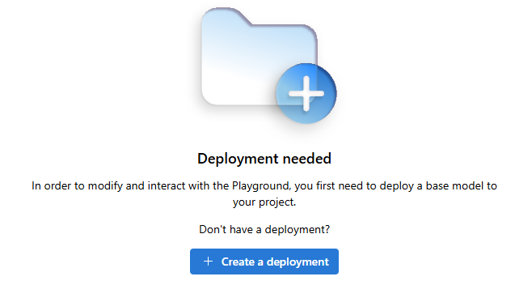

Wybrany model to `dall-e-3`

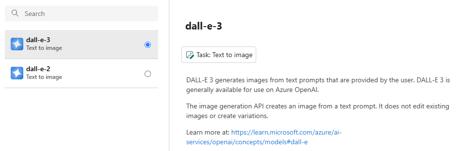

#### 2. Dodanie konfiguracji
Ponownie nie udało się skorzystać z pakietu `Azure.AI.OpenAI` zgodnie ze wskazówkami zawartymi w [learn.microsoft.com](https://learn.microsoft.com/en-us/azure/ai-services/openai/dall-e-quickstart?tabs=dalle3%2Ccommand-line%2Cjavascript-keyless%2Ctypescript-keyless&pivots=programming-language-csharp), nie zostają odnalezione klasy pakietu takie jak `AzureOpenAIClient`.

Zostanie wykorzystana specyfikacja API opisana [tutaj](https://learn.microsoft.com/en-us/azure/ai-services/openai/how-to/dall-e?tabs=dalle3)

W `appsettings.json` dodane zastała część odpowiadająca komunikacji z modelem `dall-e-3`:
```json
  "AzureOpenAIImage": {
    "Endpoint": "https://<resource name>.cognitiveservices.azure.com/openai/deployments/dall-e-3/images/generations?api-version=<version>",
    "ApiKey": "<api key>",
    "Model": "dall-e-3"
  },
```

Wartości odnależć można w `Azure AI Foundry` > `Deployments` > `dall-e-3`

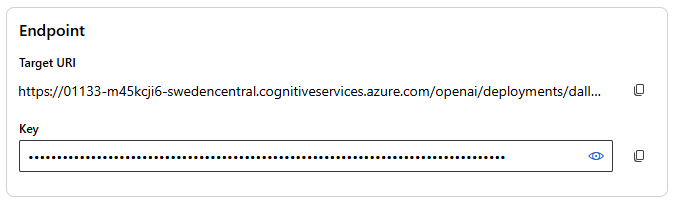

#### 3. Integracja z chatem

- Dodana zostaje klasa `OpenAIImageService` obsługująca komunikację z `dall-e-3`

- Utworzone są klasy reprezentacji zapytań i odpowiedzi modelu.
```C#
  class ImageReguest
  {
    public required string Prompt { get; set; }
    public required string Size { get; set; }
    public required int N { get; set; }
    public required string Quality { get; set; }
    public required string Style { get; set; }
  }
```

- Dodane zostają funkcje pytające użytkownika o dodatkowe ustawienia, tj.: prompt, rozmiar, styl i jakość (parametr N musi być ustawiony na 1)

- Dodane zostają kunkcje realizujące zapytanie do klienta http
```C#
    // Realizuje główną funkcjonalność 
    // Zakłada, że w zmiennej _request zostały ustawione odpowiednie pola
    private async Task<ImageResponse?> MakeRequest()
    {
      if (string.IsNullOrWhiteSpace(_request.Prompt))
      {
        return null;
      }
      try
      {
        var response = await _httpClient.PostAsJsonAsync(_endpoint, _request);
        var responseBody = await response.Content.ReadAsStringAsync();

        // Console.WriteLine(responseBody.ToString());
        var responseObject = JsonSerializer.Deserialize<ImageResponse>(responseBody, new JsonSerializerOptions
        {
          PropertyNameCaseInsensitive = true
        });

        if (!response.IsSuccessStatusCode)
        {
          Console.WriteLine($"Http error: {response.StatusCode}");
          Console.WriteLine($"Details: {responseObject}");
        }

        return responseObject;
      }
      catch (Exception ex)
      {
        Console.WriteLine($"Error: {ex.Message}");
      }
      return null;
    }
```

- Dodane zostają funkcja zapisująca pliki obrazów na dysk
```C#
    private async Task GenerateToFile(ImageResponse imageResponse, GenerationMode gMode, string destDir)
    {
      if (!ValidateDirectory(destDir))
      {
        return;
      }

      try
      {
        for (int i = 0; i < imageResponse.Data.Count; i++)
        {
          var dataItem = imageResponse.Data[i];
          string filename = $"{_model.ToUpper()}-image-{imageResponse.Created}{GenerationModeDescription.get(gMode)}";
          string path = Path.Join(destDir, filename);
          if (dataItem.Url != null)
          {

            HttpResponseMessage response = await _httpClient.GetAsync(dataItem.Url);
            response.EnsureSuccessStatusCode();
            byte[] image = await response.Content.ReadAsByteArrayAsync();
            await File.WriteAllBytesAsync(path, image);
            Console.WriteLine($"Image downloaded and saved successfully in {filename}");

          }
          else if (dataItem.Code != null)
          {
            Console.WriteLine($"Image {i}.  generation resulted in error: {dataItem.Code}");
            Console.WriteLine($"Error message: {dataItem.Message}");
          }

        }
      }
      catch (Exception ex)
      {
        Console.WriteLine($"Error occured: {ex.Message}");
      }
    }
```

- Dodana zostaje funkcja wyświetlająca na ekranie url (dla opcji url)
```C#
    private void GenerateUrl(ImageResponse imageResponse)
    {
      Console.WriteLine($"{_model.ToUpper()}: Created {imageResponse.Created}");
      for (int i = 0; i < imageResponse.Data.Count; i++)
      {
        var dataItem = imageResponse.Data[i];
        if (dataItem.Url != null)
        {
          Console.WriteLine($"Image {i}: {dataItem.Revised_Prompt}");
          Console.WriteLine($"Url: {dataItem.Url}");
        }
        else if (dataItem.Code != null)
        {
          Console.WriteLine($"Image {i}: generation resulted in error: {dataItem.Code}");
          Console.WriteLine($"Error message: {dataItem.Message}");
        }
      }
    }
```

- Dodana zostaje klauzula w switchu metdu run w klasie Application
- Dodana zostaje walidacja komendy
- Usupełniona zostaje instrukcja użytkownika

#### 4. Testowanie
- Opcja zapisu `jpg`

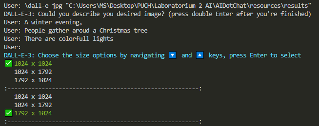

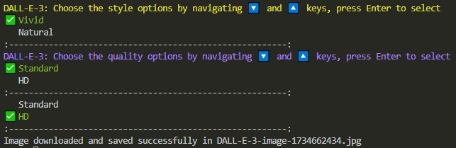

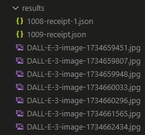

- Opcja wyświetlenia `url`

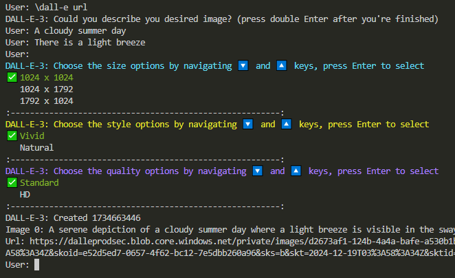

- Niewłaściwie sformatowane komendy

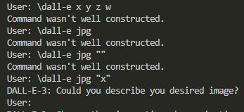

- Niektóre z uzyskanych obrazów

<table>
  <tr>
    <td>
      <div style="text-align: center;">
        
      </div>
    </td>
    <td>
      <div style="text-align: center;">
        
      </div>
    </td>
    <td>
      <div style="text-align: center;">
        
      </div>
    </td>
  </tr>
</table>

