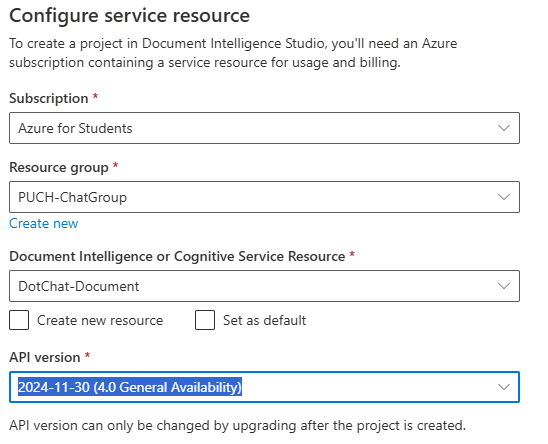

DotChat
===
`etap-3`
1. [Custom Document](#1-custom-document)
  - [Storage Account](#4-tworzenie-storage-account)
  - [Blob Storage Container](#5-dodanie-kontenera-do-storage-account)
  - [Projekt w Document Intelligence Studio](#7-utworzenie-projektu-w-document-intelligence-studio)
  - [Trenowanie modelu]()
  - [Integracja z czatem]()

2. [temat 7: Generowanie obrazów na podstawie opisu](#2-generowanie-obrazów-na-podstawie-opisu)

Repozytorium: [github](https://github.com/mm-sokol/PUCH-Laboratorium-AI/tree/etap-3)

Crediting data sources:
- [ExpressExpense.com](https://expressexpense.com/blog/free-receipt-images-ocr-machine-learning-dataset/)
- [OCR Receipts from Grocery Stores Text Detection - kaggle dataset](https://www.kaggle.com/datasets/trainingdatapro/ocr-receipts-text-detection)

```yaml
:--------------------------------------------------------:
               D O T  C H A T  gpt-4
:--------------------------------------------------------:
 Here are some usefull commands:
  \user <username> - to register your username
  \system <text> - to provide context for the AI assistant
  \save <filename> - to save your chat history in a file
  \clear - to clear the chat history
  \exit - for leaving the chat

  \vision [options] - predicts weather from 
  given image with Azure Custom Vision
  \vision img "<path to img>"
  \vision url "<url with img>"

  \summarize [options] - creates summaries of pdf files with OpenAI
  \summarize pdf "<in filename>" to "<out filename>"
  \summarize dir "<source path>" to "<dest path>"
  \summarize ... -v|--verbose - outputs summary to screen

  \doc <filename> - [in the making]
  \img <description> - [in the making]
  ...
```

### 1. Custom Document

1. Ze względu na to, że w poprzednim etapie został już utworzony zasób Document Intelligence ten krok został tu pominięty
2. Przejście do `Document Intelligence Studio`


3. Wybranie `Custom extractoin model` na dole strony


Ponieważ projekt wymaga użycia `Blob Storage Container` został utworzony `Storatge Account`

#### 4. Tworzenie `Storage Account`


#### 5. Dodanie kontenera do `Storage Account`


6. Dodanie danych traningowych do kontenera


#### 7. Utworzenie projektu w `Document Intelligence Studio`


*krok 1 w konfiguracji projektu*


*krok 2 w konfiguracji projektu*



*krok 3 konfiguracji*


#### 8. Trenowanie modelu

- etykietowanie danych automatyczne


*nie było możliwe zaetykietowanie wszystkich obrazów*


*obrazy były etykietowane pojedyńczo*

*okazjonalnie występowały konfilkty etykiet*


*rozwiązywane przez usuwanie jednej z nakładających się etykiet*


<table>
  <tr>
    <th colspan="2">Wyniki etykietowania</th>
    <th colspan="1">Przykładowe Etykiety</th>
  </tr>
  <tr>
    <td>
      <div style="text-align: center;">
        
      </div>
    </td>
    <td>
      <div style="text-align: center;">
        
      </div>
    </td>
    <td>
      <div style="text-align: center;">
        
      </div>
    </td>
  </tr>
</table>


### 2. Generowanie obrazów na podstawie opisu